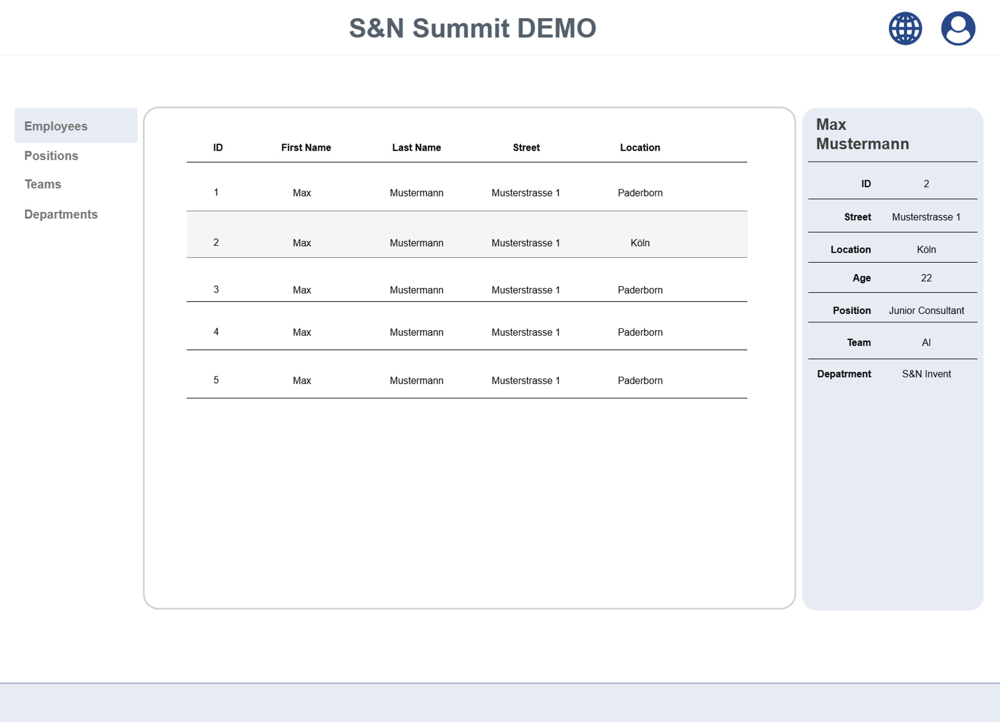

# Workshop Ziel
Entwicklung mit dem Coding Assistenten kennenlernen:

Dazu erstellen wir eine Webanwendung in Angular mithilfe des Coding Assistenten Continue (KI Agenten Claude).

1. Anforderungen Definieren (bereits vorhanden, siehe Kontext)
2. Prompting & Generation Process (Your Job) -
Einen Promt erstellen oder die Vorlage in /prompt.md verwenden &
den Kontext hinzufügen
3. Experten-Review & Kritische Analyse (Your Job)

Das ist ein iterativer/agiler Prozess scheue dich nicht zwischen den Schritten hin und her zu springen.

### Aufgabe 
Erstellung eines UI zur Einsicht von Mitarbeiterdaten, bestehend aus einer navigierbaren Übersichtstabelle und Mitarbeitersteckbriefen. Sowie die Anbindung an der API in  [API Beschreibung Dummy JSON USER](dummy-json-user-api.yml)

Wähle einen Ansatz.

**Nummer 1: APP in einem Durchlauf Prompt Ansatz**
Der Prompt in [Prompt](prompt.md) ist dafür gedacht den Agenten die Applikation in einen Durchlaufen zu generieren. Du lehnst dich zurück und bestätigst was der Agent generiert.  
Achte darauf, der Agent könnte nach einer Weile abbrechen. Dann muss ihn Anweisen den nächsten Schritt umzusetzen

**Step by Stepp Prompt Ansatz:**
In diesen  Ansatz wollen wir die Kontrolle darüber übernehmen, welchen Schritt Agent umsetzt. Hier ist der Prompt vorbereitet: [text](prompt_step_by_step.md)  

Mögliche Schritte.  
1. 3 Spalten Layout erstellen
2. Datenmodel von API ableiten iund API Service erstellen
3. Komponenten Logik erstellen 
    - Seitenmenü Departments
    - Tabelle 
    - Mitarbeitersteckbrief
4. Tests schreiben

### Kontext
Hier sind die Anforderungen an das Produktziels beschrieben.

Das Bild des Prototypen */prototype.png*  
  
Beschreibung des Prototypen:[Claude Beschreibung des Prototypen](prototype_description.md)  

3 User Stories mit Akzeptanzkriterien [Markdown mit User Stories](user_storys.md)  
Dummy JSON User OpenAPI Spezifikation [Api Spezifikation](dummy-json-user-api.yml)  
